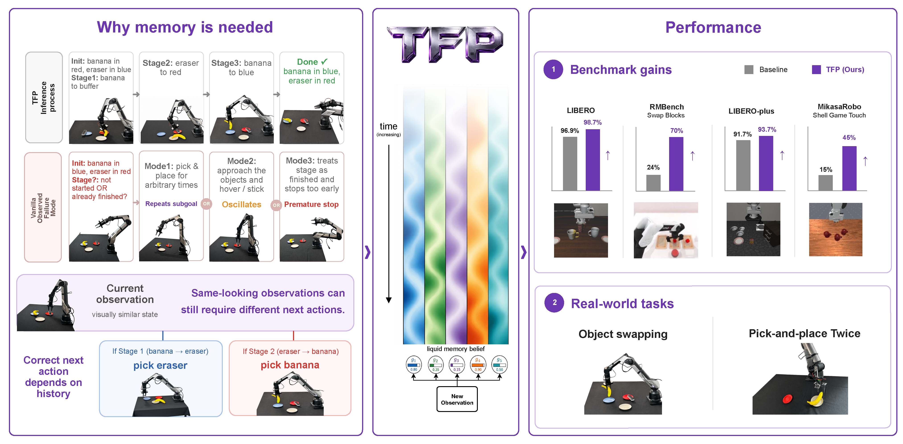
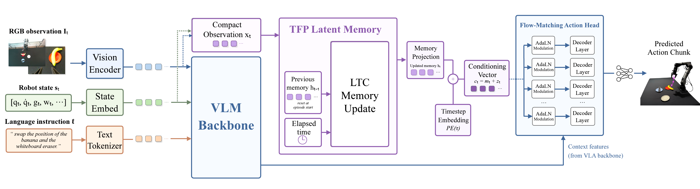

<div align="center">

# TFP: Temporally Conditioned Memory-Fusion Policies for Visuomotor Learning

Yushen Liang<sup>†</sup>, Yue Peng<sup>†</sup>, Baosheng Jin<sup>†</sup>, Tianluo Zhang, Xinyu Zhang, Shuyi Zhou, Zhuoran Chen, Xinqi Liu, Shenji Wan

<sup>†</sup> Equal contribution

[](https://arxiv.org/abs/2607.08283)


**Accepted to the SemRob 2026 Workshop at Robotics: Science and Systems (RSS 2026).**

</div>

<p align="center">
  
</p>

## Overview

Vision-language-action policies are often reactive: they predict the next action from the current observation, instruction, and robot state. This assumption breaks down in stage-dependent manipulation, where visually similar observations can require different actions depending on latent task progress and previous interaction outcomes.

**Temporally Conditioned Memory-Fusion Policies (TFP)** augment a VLA backbone with an episode-local latent belief governed by Liquid Time-Constant dynamics. The updated belief is injected directly into the flow-matching action decoder through AdaLN-style modulation, allowing temporally accumulated context to shape generated action chunks rather than serving only as passive history.

<p align="center">
  
</p>

<p align="center"><em>TFP maintains a continuous-time latent belief and injects it into the action decoder through adaptive modulation.</em></p>

TFP is designed to:

- preserve task progress through stable, occluded, or visually ambiguous phases;
- update its belief near contacts, releases, and subgoal transitions; and
- condition action generation on both the current observation and the inferred task stage.

## Results

| Benchmark / task | Reactive π0.5 | TFP |
| --- | ---: | ---: |
| LIBERO average success | 96.85% | **98.75%** |
| LIBERO Long-10 | 92.4% | **97.0%** |
| LIBERO-plus average robustness | 91.4% | **93.77%** |
| MIKASA-Robo ShellGameTouch | — | **75.0%** |
| Galaxea A1 object swap | 3/20 | **15/20** |
| Galaxea A1 counting pick-and-place | 8/20 | **18/20** |

Mechanistic analyses show that LTC write-gain changes are approximately **6× larger near manipulation events** than during far non-event phases. Hidden-state interventions further demonstrate that changing only the learned belief can alter generated action chunks while the observation, robot state, language instruction, and flow-matching noise remain fixed.

## Citation

If you find this work useful, please cite:

```bibtex
@article{liang2026tfp,
  title         = {TFP: Temporally Conditioned Memory-Fusion Policies for Visuomotor Learning},
  author        = {Liang, Yushen and Peng, Yue and Jin, Baosheng and Zhang, Tianluo and Zhang, Xinyu and Zhou, Shuyi and Chen, Zhuoran and Liu, Xinqi and Wan, Shenji},
  year          = {2026},
  eprint        = {2607.08283},
  archivePrefix = {arXiv},
  primaryClass  = {cs.RO}
}
```
