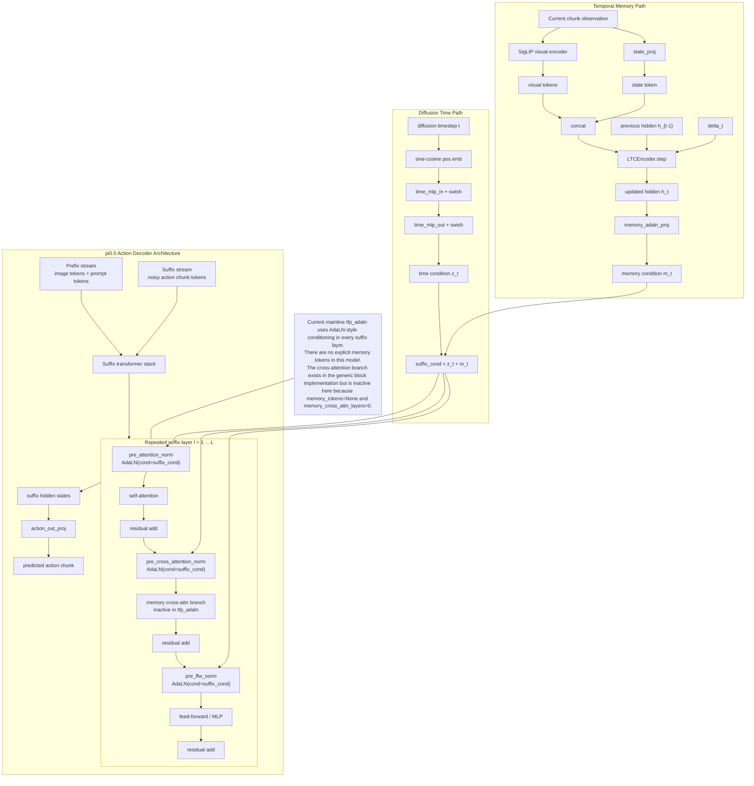

# TFP AdaLN Layer Architecture

This figure shows the model architecture, not the training flow. It focuses on where the memory-derived AdaLN condition
enters the suffix transformer stack in the current `tfp_adaln*` mainline.

Source: [docs/tfp_adaln_layer_architecture.mmd](../docs/tfp_adaln_layer_architecture.mmd)

Code references:

- [src/openpi/models/pi0_adaln.py](../src/openpi/models/pi0_adaln.py:322)
- [src/openpi/models/pi0_adaln.py](../src/openpi/models/pi0_adaln.py:330)
- [src/openpi/models/pi0_adaln.py](../src/openpi/models/pi0_adaln.py:376)
- [src/openpi/models/gemma.py](../src/openpi/models/gemma.py:373)
- [src/openpi/models/gemma.py](../src/openpi/models/gemma.py:387)
- [src/openpi/models/gemma.py](../src/openpi/models/gemma.py:409)
