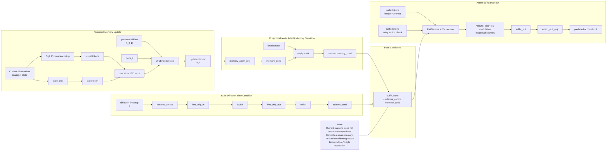

# TFP AdaLN Memory Injection

This figure matches the current `tfp_adaln*` mainline model.

Unlike the older `tfp` variant, this version does **not** build explicit memory tokens for suffix cross-attention.
Instead, it projects the recurrent hidden state into a conditioning vector and injects it through the suffix decoder's
adaptive normalization pathway.

Source: [docs/tfp_adaln_memory_injection.mmd](../docs/tfp_adaln_memory_injection.mmd)

Relevant code:

- [src/openpi/models/pi0_adaln.py](../src/openpi/models/pi0_adaln.py:322)
- [src/openpi/models/pi0_adaln.py](../src/openpi/models/pi0_adaln.py:330)
- [src/openpi/models/pi0_adaln.py](../src/openpi/models/pi0_adaln.py:354)
- [src/openpi/models/gemma.py](../src/openpi/models/gemma.py:373)
