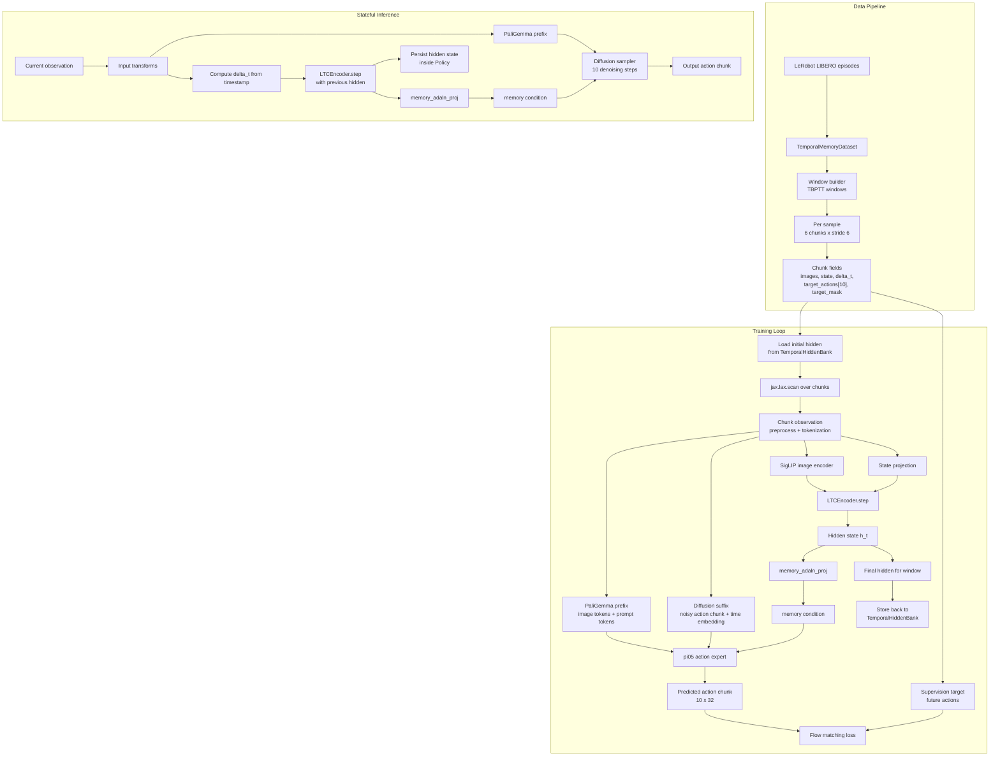

# TFP Pro Pipeline

This diagram reflects the current `tfp_pro` mainline temporal-memory model, which is the `tfp_adaln_curriculum`
family in [src/openpi/training/config.py](../src/openpi/training/config.py:765).

The Mermaid source lives in [docs/tfp_pro_pipeline.mmd](../docs/tfp_pro_pipeline.mmd).



## Render

If you have Mermaid CLI available elsewhere, render it with:

```bash
mmdc -i docs/tfp_pro_pipeline.mmd -o docs/tfp_pro_pipeline.svg
```

Relevant code paths:

- [src/openpi/training/temporal_memory_loader.py](../src/openpi/training/temporal_memory_loader.py:146)
- [src/openpi/models/temporal_memory.py](../src/openpi/models/temporal_memory.py:8)
- [src/openpi/models/pi0_adaln.py](../src/openpi/models/pi0_adaln.py:72)
- [scripts/train.py](../scripts/train.py:475)
- [src/openpi/policies/policy.py](../src/openpi/policies/policy.py:139)
