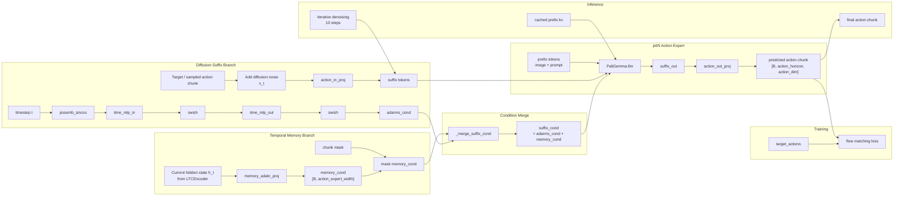

# TFP Suffix Memory Condition

This diagram isolates the current `Pi0AdaLN` memory-conditioning path used by the `tfp_adaln*` configs.

Source: [docs/tfp_suffix_memory_condition.mmd](../docs/tfp_suffix_memory_condition.mmd)

Relevant code:

- [src/openpi/models/pi0_adaln.py](../src/openpi/models/pi0_adaln.py:322)
- [src/openpi/models/pi0_adaln.py](../src/openpi/models/pi0_adaln.py:354)
- [src/openpi/models/pi0_adaln.py](../src/openpi/models/pi0_adaln.py:386)
